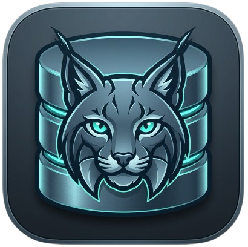
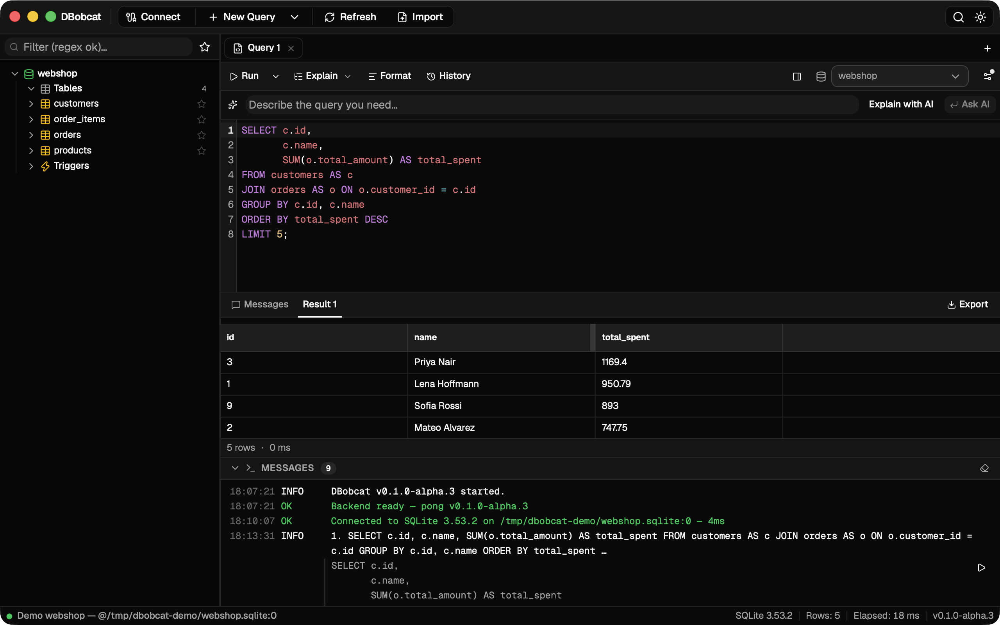
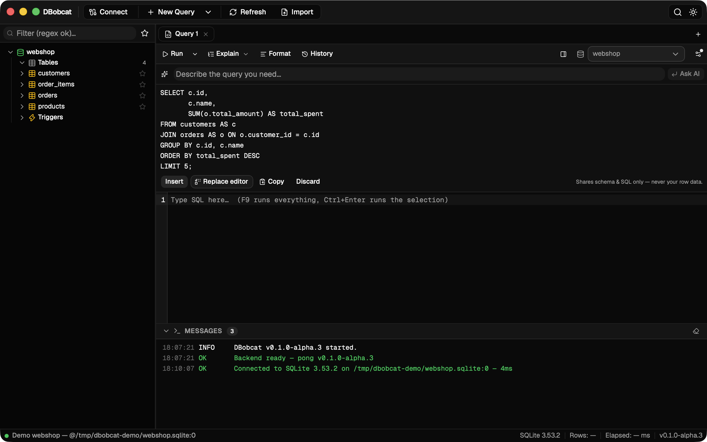
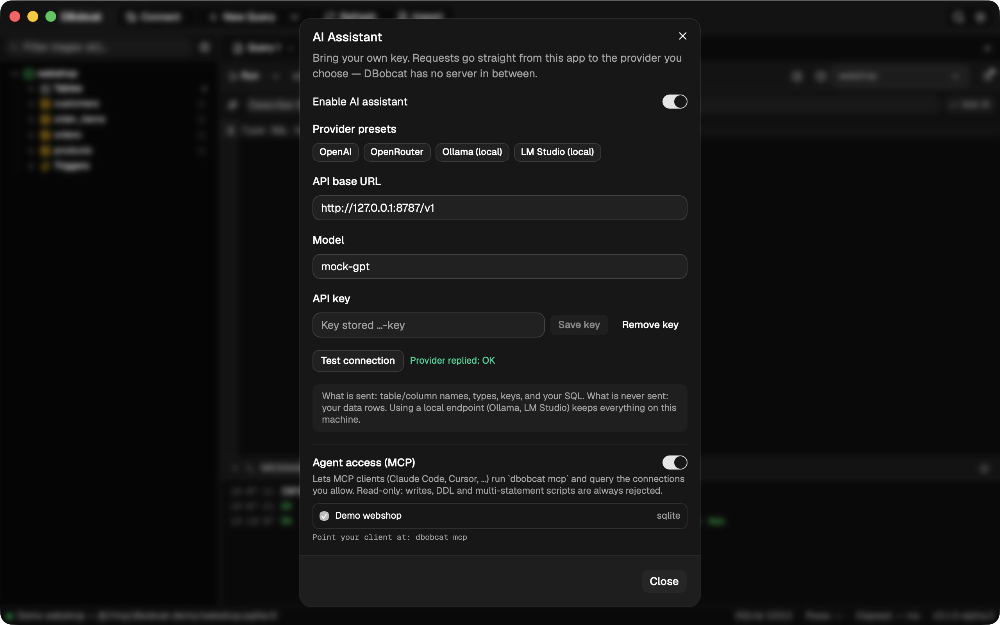
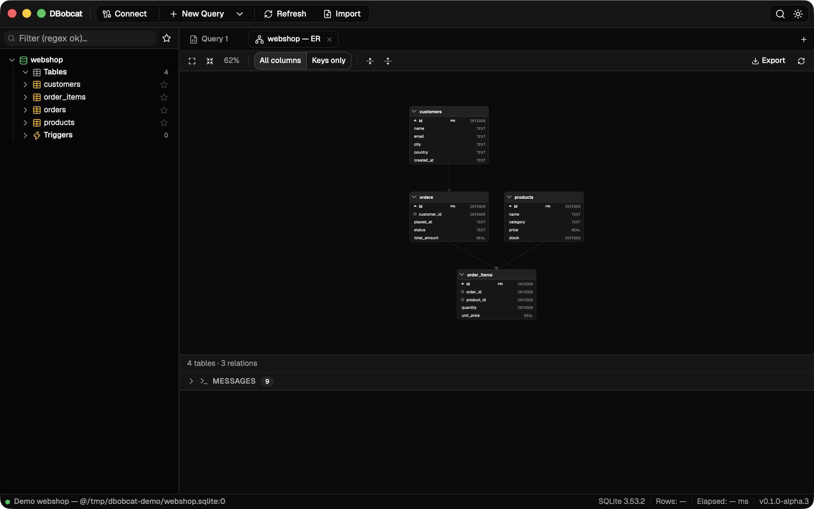

<p align="center">
  
</p>

<h1 align="center">DBobcat</h1>

<p align="center">
  <a href="https://github.com/AamiRobin/dbobcat/actions/workflows/ci.yml"></a>
  <a href="LICENSE"></a>
</p>

DBobcat (**d**atabase + bobcat) is an open-source, cross-platform database GUI client for MySQL/MariaDB, PostgreSQL, and SQLite — inspired by [HeidiSQL](https://www.heidisql.com/), built with a modern stack.

Repository: <https://github.com/AamiRobin/dbobcat>

## Install

Download a build from [Releases](https://github.com/AamiRobin/dbobcat/releases/latest):

- **macOS (Apple Silicon only)** — `.dmg` (or the `.app.tar.gz` if you'd rather extract by hand)
- **Windows** — NSIS `-setup.exe`
- **Linux** — `.AppImage` (may need `chmod +x`) or `.deb`

### macOS first launch: "DBobcat is damaged and can't be opened"

The app is **not** actually damaged. Builds are currently unsigned — there is no
Apple Developer certificate behind them — and macOS Gatekeeper refuses *any*
quarantined, unsigned download with that exact (misleading) message: browsers
tag every downloaded file with a quarantine attribute, and Gatekeeper treats
"unsigned + quarantined" as "damaged". The bits on disk are fine.

Clear the quarantine flag once and the app opens normally from then on:

```sh
xattr -cr /Applications/DBobcat.app
```

Point the path at wherever the app lives — if you haven't moved it out of
Downloads yet, use `~/Downloads/DBobcat.app`. If you'd rather not touch the
Terminal: System Settings → Privacy & Security → scroll to the Security
section → **Open Anyway**. (The older right-click → *Open* bypass no longer
works on recent macOS.) Note that this only affects browser downloads —
`curl`/`git`/Homebrew don't set the quarantine flag.

### Windows first launch: SmartScreen warning

Same story, Windows flavor: installers are unsigned, so SmartScreen shows
"Windows protected your PC". Choose **More info → Run anyway**.

## Screenshots

| | |
|---|---|
|  |  |
| *Query editor & virtualized result grid* | *AI assistant drafts SQL — you run it* |
|  |  |
| *BYOK AI settings + read-only MCP agent access* | *Auto-laid-out ER diagram* |

## Features

- **Session manager** with SSH tunnels, TLS, and AES-GCM-encrypted password storage (optional master password)
- **Virtualized data grid** with inline editing, filtering/sorting, BLOB handling, and a local changeset you post to the server ("Post changes", HeidiSQL-style)
- **Query editor** with schema-driven completion, multi-query execution, history, and formatting
- **Table designer** with columns/indexes/foreign keys and an ALTER preview before applying
- **Full export matrix** — SQL dump, CSV, HTML, XML, JSON, LaTeX, Markdown, PHP, Textile; gzip; clipboard; plus CSV import
- **Server tools** — user manager, process list, find text across tables, copy table
- **Schema diagram** — auto-laid-out ER view of a database with export to SVG/PNG
- **Command palette** (Mod+K), SQL snippets, per-connection transaction defaults
- **AI assistant** (opt-in, Mod+I) — natural language → SQL, fix-my-query, and explanations against any OpenAI-compatible provider (including local Ollama/LM Studio). Schema metadata only is shared — never row data
- **MCP server** (`dbobcat mcp`) — let Claude Code, Cursor, or any MCP client query your allowlisted connections read-only; [docs](docs/MCP.md)
- Multi-engine via a driver abstraction (one tokio task per connection)

## Tech stack

[Tauri 2](https://tauri.app/) + Rust backend, React 19 + TypeScript (strict) + Vite frontend, shadcn/ui + Tailwind CSS v4, CodeMirror 6.

## Development

Prerequisites: [bun](https://bun.sh) ≥ 1.1 and a stable Rust toolchain.

```sh
bun install          # install frontend dependencies
bun run tauri dev    # run the desktop app in dev mode
```

### Tests & checks

```sh
bun test                                   # frontend unit tests
cd src-tauri && cargo test                 # Rust unit tests
cargo clippy --all-targets -- -D warnings  # lint
```

## CLI flags

`dbobcat --connect <session>` / `dbobcat --new-query [session]` — see [`docs/CLI.md`](docs/CLI.md).

## License

MIT. See the About dialog in-app.

## Credits

Inspired by [HeidiSQL](https://www.heidisql.com/) — thanks for decades of ideas.
